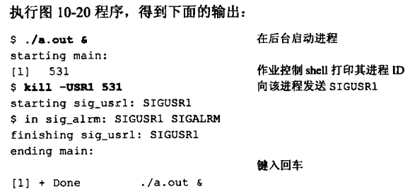
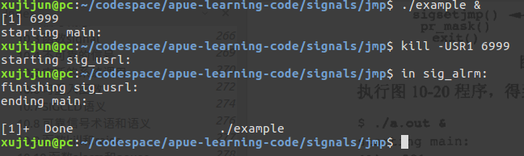

# 信号部分学习笔记
1. `apue.h`中的`signal`函数只会生效一次，而在ubuntu16.04和centos7.3上均会一直生效
2. ubuntu16.04中的`sigsetjmp`和`siglongjmp`运行时没有出现APUE中说到的“当调用一个信号处理程序时，被捕捉到的信号加到进程的当前信号屏蔽字中。当从信号处理程序返回时，恢复原来的屏蔽字。另外，siglongjmp恢复了sigsetjmp所保存的信号屏蔽字”
- APUE中例程（图10-20）的执行结果为

- ubuntu16.04上执行结果为

