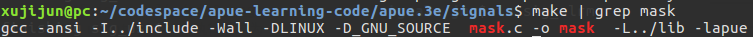
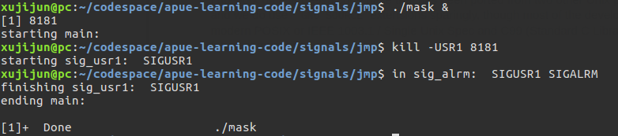
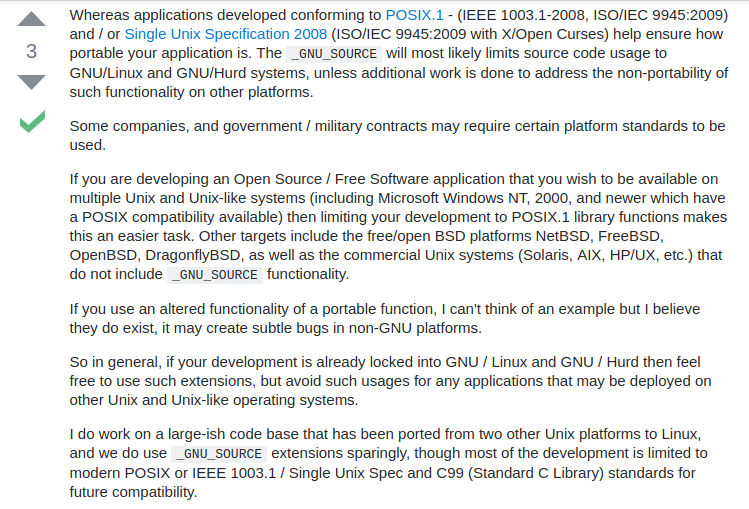

# 信号部分学习笔记
1. `apue.h`中的`signal`函数只会生效一次，而在ubuntu16.04和centos7.3上均会一直生效
------

2. ubuntu16.04中的`sigsetjmp`和`siglongjmp`运行时没有出现APUE中说到的“当调用一个信号处理程序时，被捕捉到的信号加到进程的当前信号屏蔽字中。当从信号处理程序返回时，恢复原来的屏蔽字。另外，siglongjmp恢复了sigsetjmp所保存的信号屏蔽字”

- APUE中例程（图10-20）的执行结果为
-

- ubuntu16.04上执行结果为
-

因为已经不是第一次出现自己的平台与APUE中运行的情况不同，还是决定仔细找找原因。代码上面是完全照着书中敲的，那问题有可能出在编译上。
- 对官方代码给出的编译方式进行观察：
- 

编译选项里面，比我自己多了两个选项：`-DLINXU`和`-D_GNU_SOURCE`。于是尝试着把第一个选项删了再编译执行，执行结果就和APUE中的一样了。

- 新的运行结果
- 

显然其中起作用的就是`-D_GNU_SOURCE`。

- StackOverflow给出使用该选项的解释是：
-

